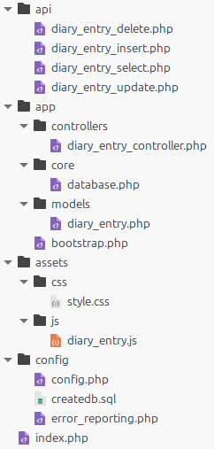
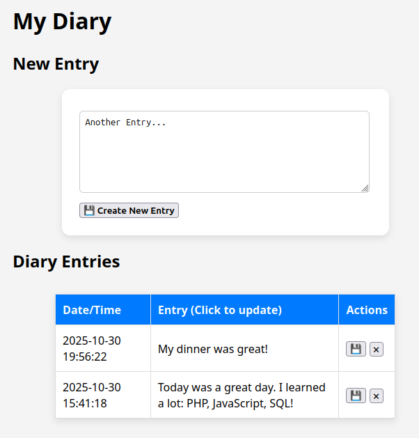

# Simple CRUD (Create-Read-Update-Delete) demo using AJAX, JavaScript, PHP, MySQL 

This webapp is a simple diary app. 

You can create, update and delete diary entries, and list all entries in descending order.

## Project structure

## Layers (Frontend - API - Backend)

    [ Browser / JS ]
            |
            |  (fetch, POST, GET, JSON)
            v
    [ API endpoints (PHP files) ]
            |
            |  (call Controller methods)
            v
    [ Controllers ]  →  [ Models ]  →  [ Database ]

## Layers in Detail

| Layer          | Purpose                              | File(s)                         |
| -------------- | ------------------------------------ | ------------------------------------ |
| **Frontend**   | UI and user interaction              | `index.php`, `assets/js/diary_entry.js`              |
| **API**        | Interface between frontend & backend | `api/diary_entry_xxx.php`, ...       |
| **Controller** | Business logic                       | `app\controllers\diary_entry_controller.php` |
| **Model**      | Data logic (CRUD)                    | `app\models\diary_entry.php`                |
| **Database**   | Low-level SQL connection             | `app\core\database.php`              |

## Calling order

- index.php 
  - assets/js/diary_entry.js
    - api/diary_entry_xxx.php 
      - app/controllers/diary_entry_controller.php
        - app/models/diary_entry.php
          - app/core/database.php

## Screenshot

## How to create the database

Run the SQL script [config/createdb.sql](config/createdb.sql).

The database credentials must be set in [config/config.php](config/config.php).

## Parameter BASE_URL in index.php 

This line in index.php need to be changed according to the directory where this app is placed.

    const BASE_URL = "/diary"; // <--- This may need to be changed.
